<div align="center">

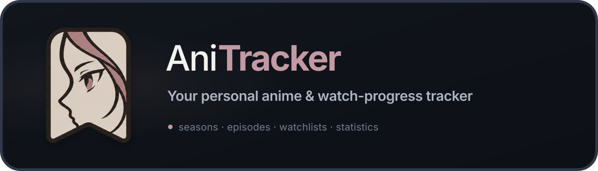

[](https://github.com/RGBond007/anitracker/actions/workflows/ci.yml)
[](LICENSE)


**A private, self-hosted anime and manga tracker for households and small communities.**

[**Live demo**](https://rgbond007.github.io/anitracker/demo/) · [Features](#features) · [Quick start](#quick-start) · [Screenshots](#screenshots) · [Installation](INSTALL.md) · [Contributing](CONTRIBUTING.md) · [Support](SUPPORT.md)

The demo runs entirely in your browser — no account, no server, nothing installed.

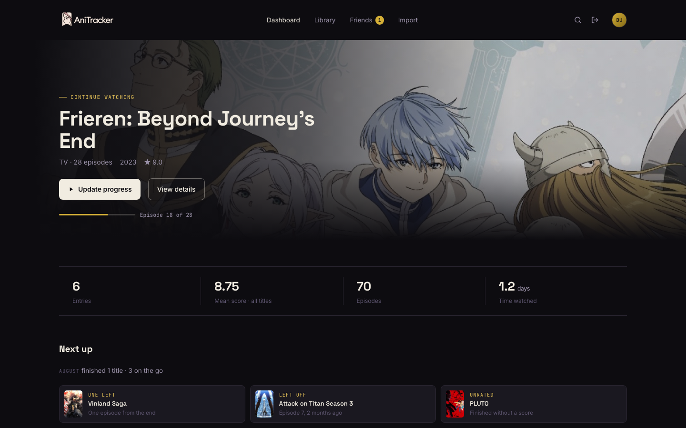

</div>

---

## Quick start

Two containers, a prebuilt image, no third-party account or API key. Nothing is
compiled on your machine, and `linux/amd64` and `linux/arm64` are both published,
so a Raspberry Pi or an ARM NAS works the same as a desktop.

```bash
mkdir anitracker && cd anitracker
curl -O https://raw.githubusercontent.com/RGBond007/anitracker/main/docker-compose.yml
curl -o .env https://raw.githubusercontent.com/RGBond007/anitracker/main/.env.example
printf '\nJWT_SECRET=%s\n' "$(openssl rand -hex 32)" >> .env
docker compose up -d
```

Then open <http://localhost:8000> and the first-run wizard creates your admin account.

> [!TIP]
> For production deployment, HTTPS setup, backups, restores, and upgrades, see the
> [installation guide](INSTALL.md).

---

## Screenshots

### Seasons

A show is one entry in your library, not one per season — and browsing a season is not the same
thing as watching it. Every season, movie, OVA and special is grouped under the series in release
order, each with its own poster, episode count, progress and status. Tapping one shows it. Only an
explicit action moves the season you are **currently watching**, so you can read season 1's synopsis
without losing your place in season 6.

<table>
<tr>
<td width="50%">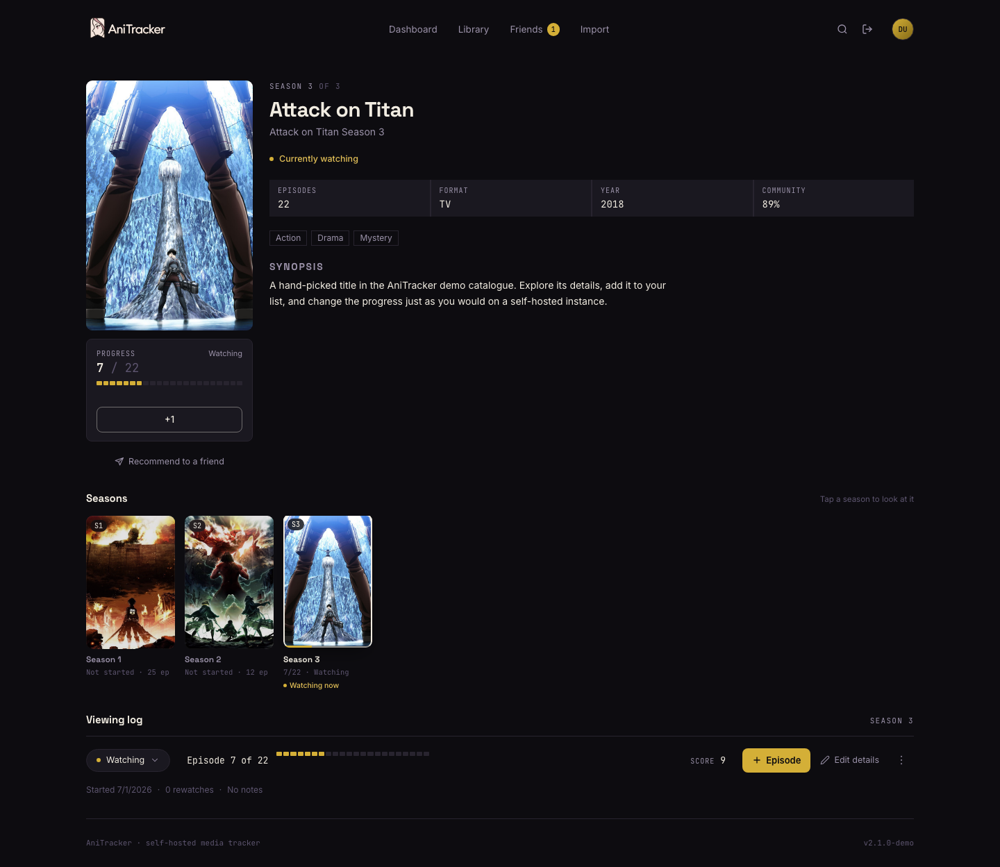</td>
<td width="50%">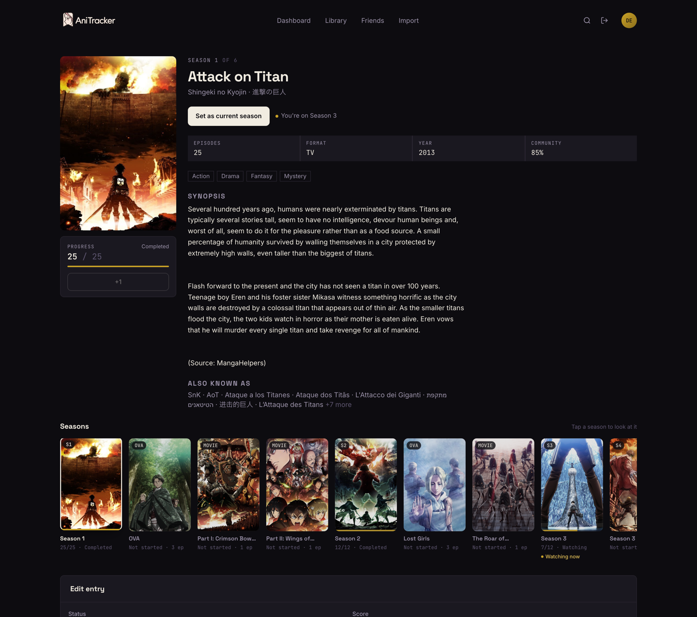</td>
</tr>
<tr>
<td align="center"><em>On season 3 — the current season, marked <strong>Watching now</strong></em></td>
<td align="center"><em>Looking at season 1: its poster and progress, and you are still on season 3</em></td>
</tr>
</table>

When you finish a season, AniTracker offers to close it out and continue — it never moves you on its
own. In search, a show collapses to one card, and you choose which season or related entry to add.

<table>
<tr>
<td width="50%">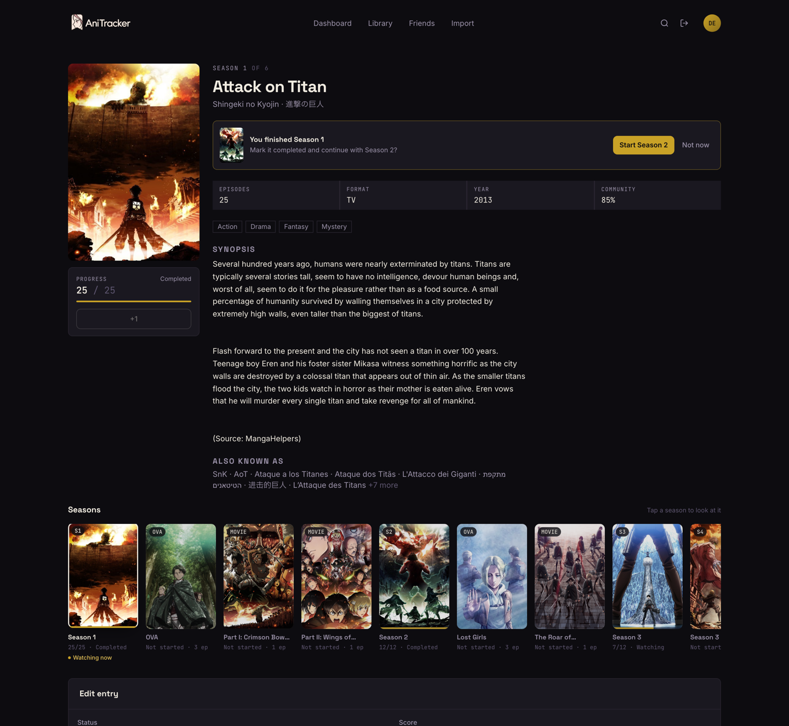</td>
<td width="50%">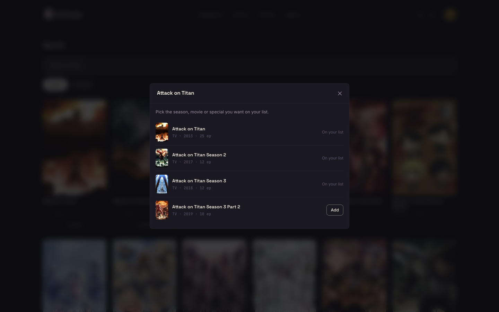</td>
</tr>
<tr>
<td align="center"><em>Offered, not applied</em></td>
<td align="center"><em>One card per show; pick what you actually want</em></td>
</tr>
</table>

### Library, search, light mode

<table>
<tr>
<td width="50%">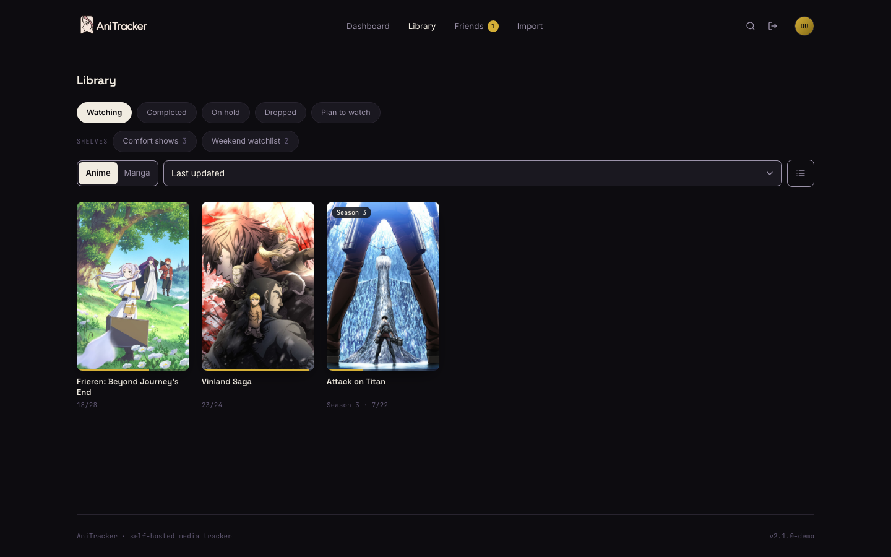</td>
<td width="50%">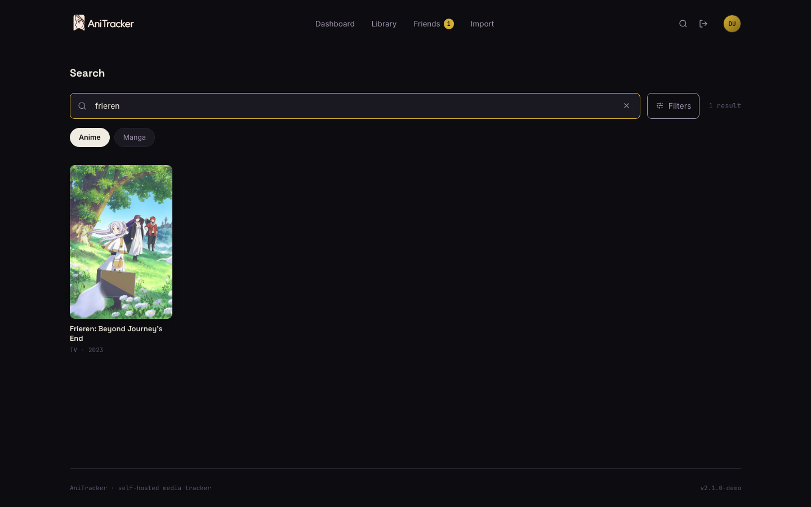</td>
</tr>
<tr>
<td align="center"><em>One card per show, following the season you're on</em></td>
<td align="center"><em>Search across AniList, Jikan and Kitsu</em></td>
</tr>
</table>

<table>
<tr>
<td width="60%">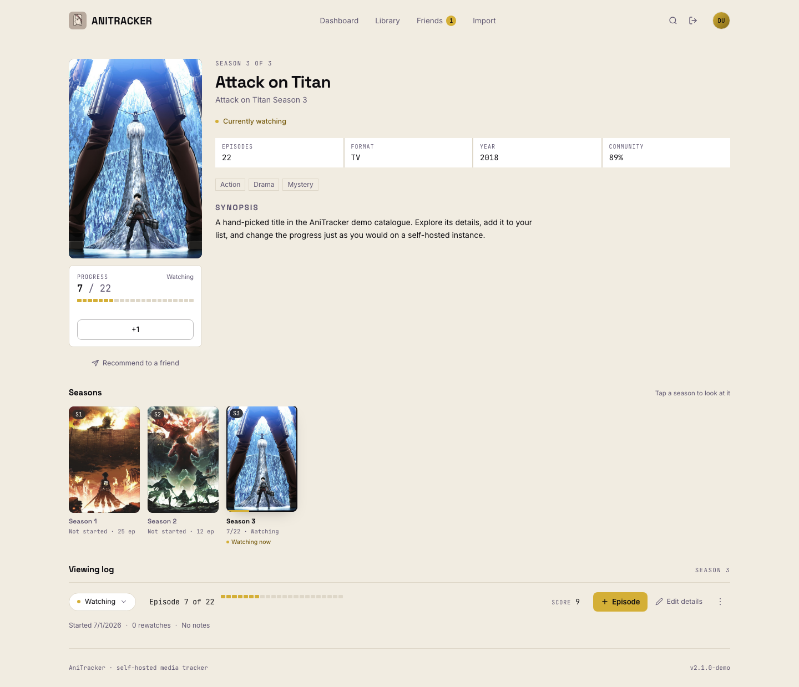</td>
<td width="20%">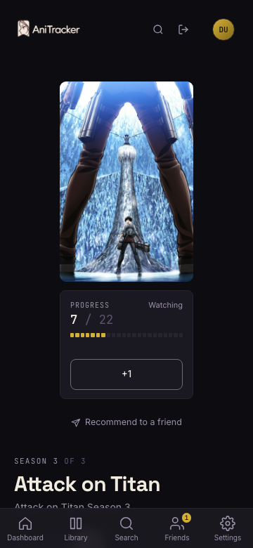</td>
<td width="20%">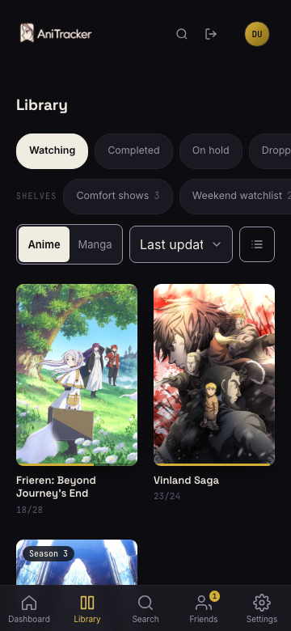</td>
</tr>
<tr>
<td align="center"><em>Light mode — the same six palette tokens, re-roled</em></td>
<td colspan="2" align="center"><em>Compact season chips on a phone, no scrolling past the synopsis</em></td>
</tr>
</table>

### Shelves, and what to watch next

A shelf is a collection you arrange by hand, kept independent of status so finishing something
never moves it off one. Search, opened without a query, answers from your own library instead of a
popularity chart — and every row says why it is there.

<table>
<tr>
<td width="50%">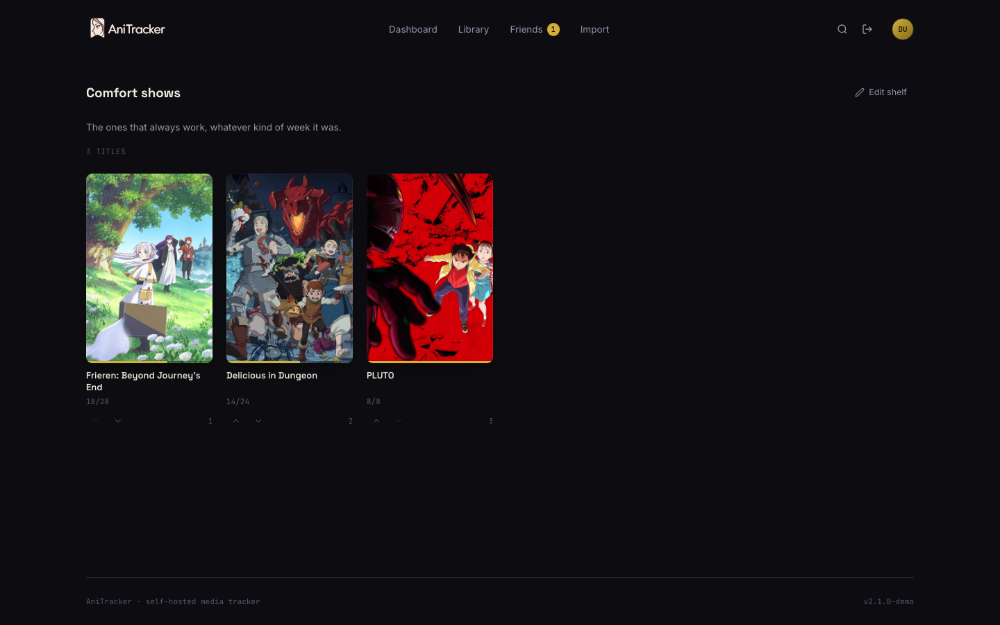</td>
<td width="50%">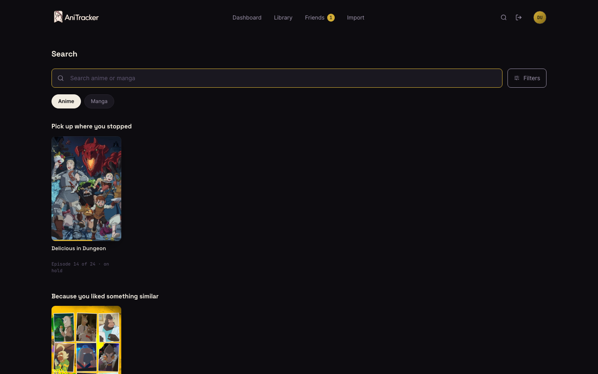</td>
</tr>
<tr>
<td align="center"><em>A shelf, in the order its owner arranged</em></td>
<td align="center"><em>Discovery that explains itself, drawn from your own backlog</em></td>
</tr>
</table>

### Friends, without a timeline

Someone hands you a title and says why. You can view it, dismiss it, or add it — adding puts it on
your plan-to-watch list and marks nothing as watched.

<table>
<tr>
<td width="100%">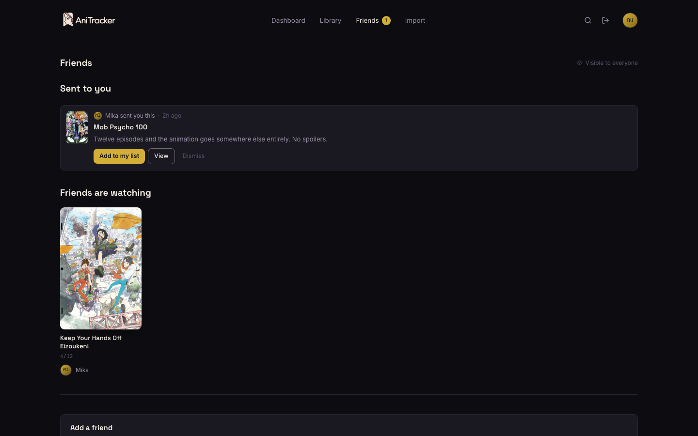</td>
</tr>
<tr>
<td align="center"><em>A recommendation from a friend, with the reason it arrived</em></td>
</tr>
</table>

---

## Features

- **Search anime & manga** through AniList, with Jikan (MyAnimeList) and Kitsu as automatic
  fallbacks when a provider rate-limits you. No account or API key with any of them.
- **Seasons, grouped and deliberate.** AniTracker walks the provider's relation graph and folds a
  show's seasons, sequel parts, movies, OVAs and specials into one library card, ordered by release
  date. Each of them keeps its own poster, episode count, progress and status — including *Not
  started* for what you have never opened. Browsing a season shows it; only an explicit
  **Set as current season** moves the season you are watching, and the card in your library follows
  that one. Finish a season and AniTracker offers to close it out and continue, rather than moving you
  on by itself.
- **Five list statuses** — watching/reading, completed, on hold, dropped, plan to watch/read —
  with score (0–10), progress, start/finish dates, rewatch count and notes.
- **Shelves.** Named, ordered collections that sit *alongside* the statuses rather than inside
  them, so a show you finished two years ago can still live on "Comfort shows". A shelf is a name,
  an optional description and a running order you arrange by hand. Nothing is seeded: "Favorites"
  and the rest are names offered when you make one, never rows written into your account.
- **Discovery from your own backlog.** When you open search without a title in mind, AniTracker
  offers what you already own: something you left on hold, a title sharing genres with one you
  rated 9+, a complete story under thirteen episodes, a genre you rarely watch, something
  untouched for months. Every row states *why* it appeared — "Because you rated Frieren 9/10",
  "12 episodes · already on your watchlist" — and anything you wave away stays away.
- **Recommendations between friends.** Hand a title to one or more friends with a short
  spoiler-free note. They can view it, dismiss it, or add it — adding lands in *plan to watch* and
  never marks anything as watched. Removing a friend takes the recommendations with it, both ways.
- **A dashboard** with what you're partway through, plus counts per status, mean score,
  episodes watched and a days-watched estimate — and a short recap of the month with two or three
  things worth opening next, each labelled with the reason it came up.
- **Progress you can see.** A season is drawn as one notch per episode rather than a percentage,
  so logging one fills a whole cell, and the count is read back in words at the points that
  matter: first episode, halfway, a cour done, finale next.
- **An airing schedule** for the week, flagging the shows you've fallen behind on.
- **Friends, if you want them** — friend requests, a feed of what they've been watching, a
  side-by-side score comparison and a household leaderboard. Lists are private to accepted friends
  until you opt into a public profile. A title's own page shows which friends have it, where they
  are with it and how their score compares with yours; finishing something can be met with one of
  five fixed reactions. There are no comment threads and nothing is counted or ranked. Notes are
  never shared — they are the one field that can spoil a story, so no social surface carries them.
- **Shelves you choose to show.** A shelf is private working space until you tick a box, and even
  then only people already allowed to see your list can see it. No links, no audiences, no
  per-person permissions.
- **Cover art, synopses and titles cached locally** for 7 days, so browsing your list never
  touches an external API.
- **Title language per user** — Romaji, English or Native — independent of the interface language.
- **Multi-user** with local email/password accounts and admin/user roles. Admins can invite people
  with a one-time password, and registration can be closed once everyone has signed up.
- **MyAnimeList import** — drop in your MAL XML export and it resolves every title, keeping your
  scores, progress, dates and comments.
- **English and German UI**, dark theme by default, light mode per user.
- **Installable** — a web manifest and icons, so it can live on a phone home screen.
- **White-labelling from the Settings page** — instance name, logo and accent colour, no redeploy.

## Project scope

AniTracker is a tracker, not a media server: it does not stream, torrent, or download media. Social
features are limited to accepted friends, with no public timeline, followers, or comment threads.
There is no native mobile app; the responsive web app is installable as a PWA. AniTracker includes no
telemetry, and its only outbound requests are to the metadata providers configured in `.env`.

---

## Requirements

- Docker Engine with Compose v2
- Approximately 700 MB of image storage (300 MB application, 400 MB PostgreSQL)
- Approximately 110 MB of memory at idle

## Configuration

Everything is environment variables, all documented in [`.env.example`](.env.example).
The only value you must set is `JWT_SECRET`.

The ones people change most:

| Variable | Default | What it does |
| --- | --- | --- |
| `JWT_SECRET` | _(none)_ | Signs sessions. Generate with `openssl rand -hex 32`. |
| `PORT` | `8000` | Host port for the web UI. |
| `COOKIE_SECURE` | `false` | Set `true` when serving over HTTPS. |
| `ALLOW_SIGNUP` | `true` | Set `false` to close registration. Admins can also toggle this in Settings. |
| `POSTGRES_PASSWORD` | `anitrack` | Change it before this leaves your LAN. |
| `RATE_LIMIT_ENABLED` | `true` | Caps repeated hits on login, registration, search and friend requests. |
| `TRUST_PROXY` | `false` | Only `true` behind a proxy you control — it makes rate limits trust `X-Forwarded-For`. |
| `INSTANCE_NAME` | `AniTracker` | Name in the header, tab title and wizard. Also editable in Settings. |
| `ACCENT_COLOR` | `#C9A227` | Stamp accent: buttons, focus rings, progress. Also editable in Settings. |
| `PROVIDER_ORDER` | `anilist,jikan,kitsu` | Which metadata APIs to try, in order. |
| `MEDIA_CACHE_TTL_DAYS` | `7` | How long cached metadata is trusted. |

## Importing from MyAnimeList

On MAL: **Profile → Export → Export Your List**, once for anime and once for manga. In AniTracker:
**Settings → Import from MyAnimeList**, then drop in the downloaded file (`.xml` or `.xml.gz`).

The importer resolves MAL ids to full metadata, keeps your score, progress, dates, rewatch count
and comments, and skips anything already on your list — so re-running it is safe. MAL's "score 0"
is imported as unscored rather than as a zero.

## Reverse proxy

AniTracker serves the UI and the API from a single origin on port 8000, so any proxy works with a
plain pass-through. Set `COOKIE_SECURE=true` once you're on HTTPS.

```caddy
anitrack.example.com {
    reverse_proxy localhost:8000
}
```

## Upgrading

`docker-compose.yml` runs a published image, so an upgrade is a pull and a restart:

```bash
docker compose pull && docker compose up -d
```

Migrations run automatically at startup. Your data lives in the named `anitrack-db` volume and
survives image replacement — see [INSTALL.md](INSTALL.md) for backups and rollbacks.

---

## Development

See [CONTRIBUTING.md](CONTRIBUTING.md) for the complete development setup, repository map,
migration workflow, translation policy, testing requirements, and pull-request process.

```bash
# Backend (needs a Postgres; see INSTALL.md for a one-liner)
cd backend
python3.12 -m venv .venv
.venv/bin/pip install -e ".[dev]"
.venv/bin/alembic upgrade head
.venv/bin/uvicorn app.main:app --reload

# In a second terminal, proxied to the backend on :8000
cd frontend
npm ci
npm run dev
```

Tests never hit the live provider APIs — they run against recorded fixtures in
`backend/tests/fixtures/` and an in-memory SQLite database, so `pytest` needs no services:

```bash
(cd backend && .venv/bin/pytest -q)
(cd backend && .venv/bin/ruff check . && .venv/bin/ruff format --check .)
(cd frontend && npm run lint && npm run build)
```

`.github/workflows/ci.yml` runs those three plus a Docker image build on every push and pull
request. API docs are generated at <http://localhost:8000/api/docs>.

## Architecture

```text
docker-compose.yml
├── app   FastAPI + the pre-built React bundle (one image, no Node at runtime)
└── db    Postgres 16
```

The frontend is React 18 + TypeScript + Vite + Tailwind, with TanStack Query owning all server
state and a single small Zustand store for UI-only state (theme, title language, toasts). Fonts
are self-hosted and bundled, so a running instance makes no external requests except to the
metadata providers.

Every external API call goes through `app/media_service.py` — never straight from a route handler —
so results land in the `media_cache` table and multiple users tracking the same show cost one
lookup, not one each. Each provider has its own token bucket, and a 429 or 5xx falls through to the
next provider in `PROVIDER_ORDER`.

Seasons are derived, not typed in. A provider only reports a title's immediate neighbours, so
`app/season_chain.py` walks back to season one and forward again to number the spine, then pulls in
the movies, OVAs and specials hanging off it — grouped under the same `root_provider_id` but left
without a `season_number`, because a movie between seasons 2 and 3 is not season 2.5. The series page
orders the result by `start_date`. That walk costs a provider call per title not yet cached, so it
runs in the background after a title is added rather than making you wait, and it is capped.

Two pieces of state are deliberately kept apart. The **viewed** season is the URL: opening a season
is a read, and nothing is written. The **current** season is a row of your own in
`franchise_selections`, keyed by the series rather than by a title, so it survives a status change
and is only ever written by `PUT /api/series/{root}/season` — which the client calls when the user
presses a button and at no other time. That endpoint also carries the optional `start` and
`complete_provider_id` flags, so "you finished season 3, start season 4?" applies as one transaction
instead of an add and a select that could half-succeed.

## Contributing

Contributions are welcome. Start with [CONTRIBUTING.md](CONTRIBUTING.md), which covers local setup,
project structure, tests, translations, database migrations, and pull-request expectations. Please
read the [Code of Conduct](CODE_OF_CONDUCT.md) before participating.

- Use the issue forms for reproducible bugs and scoped feature proposals.
- Use [SUPPORT.md](SUPPORT.md) for installation and usage help.
- Report vulnerabilities privately according to [SECURITY.md](SECURITY.md).
- Significant features and breaking changes should be discussed before implementation.

Project decisions and releases are documented in [GOVERNANCE.md](GOVERNANCE.md) and
[RELEASING.md](RELEASING.md).

## License

AniTracker is licensed under the [GNU Affero General Public License v3.0 only](LICENSE)
(`AGPL-3.0-only`). If you modify AniTracker and make it available to users over a network, the
license requires you to offer those users the corresponding source code for your modified version.
